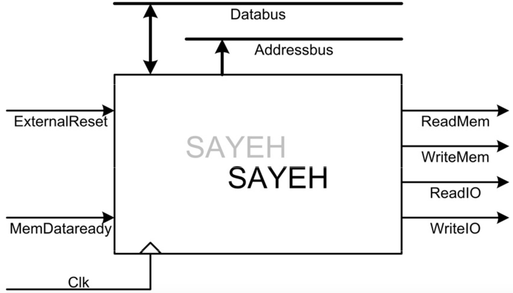
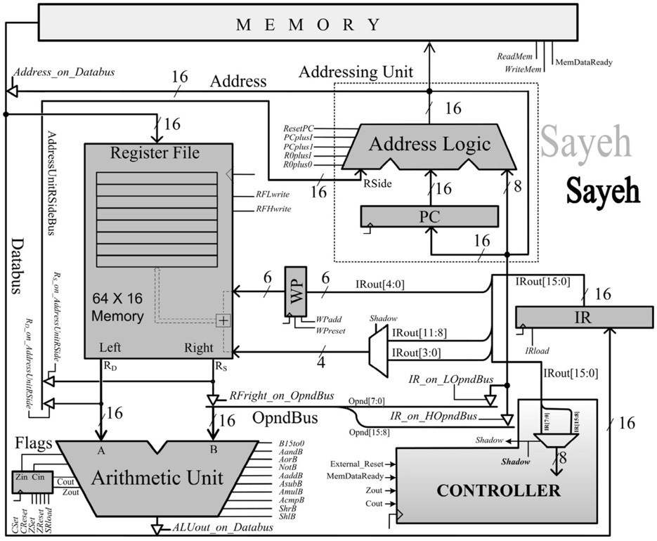

[SAYEH](https://github.com/aminrashidbeigi/SAYEH.git)
=
This CPU exploits a 16-bit data-bus and also a 16-bit
address-bus. Instructions used in this processor has 8 or 16-bit width. Short instructions (8-bit
ones) contain shadow instructions, which effectively pack 2 such instructions (8-bit) into a single
16-bit word.

Overveiw
-

  

Datapath
-

  

Controller
-

  

